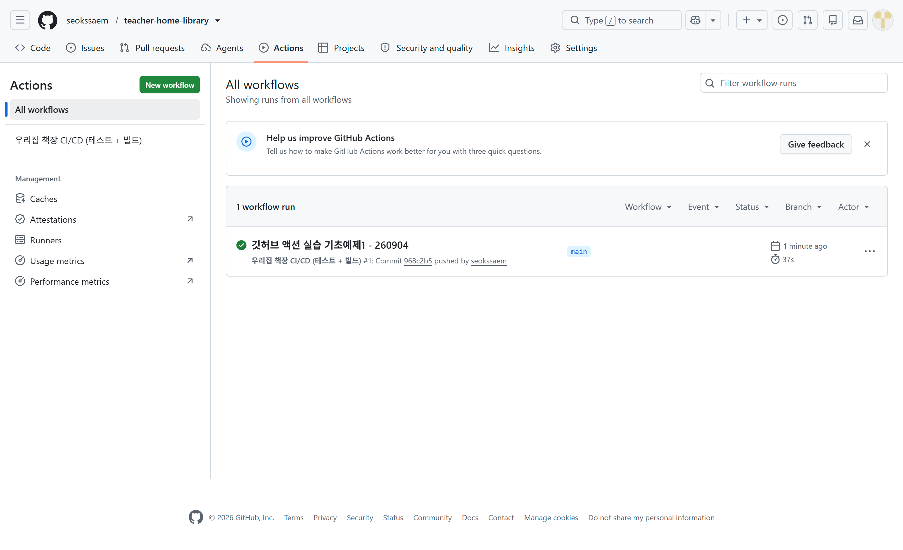
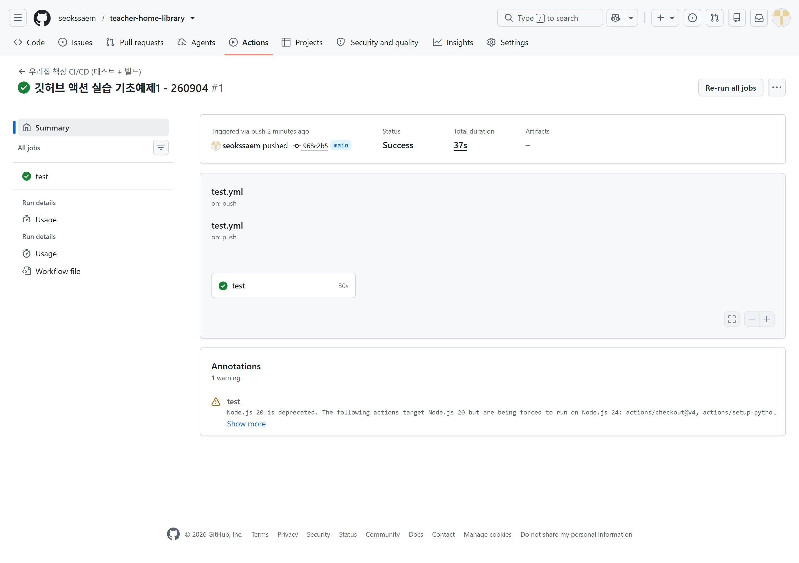
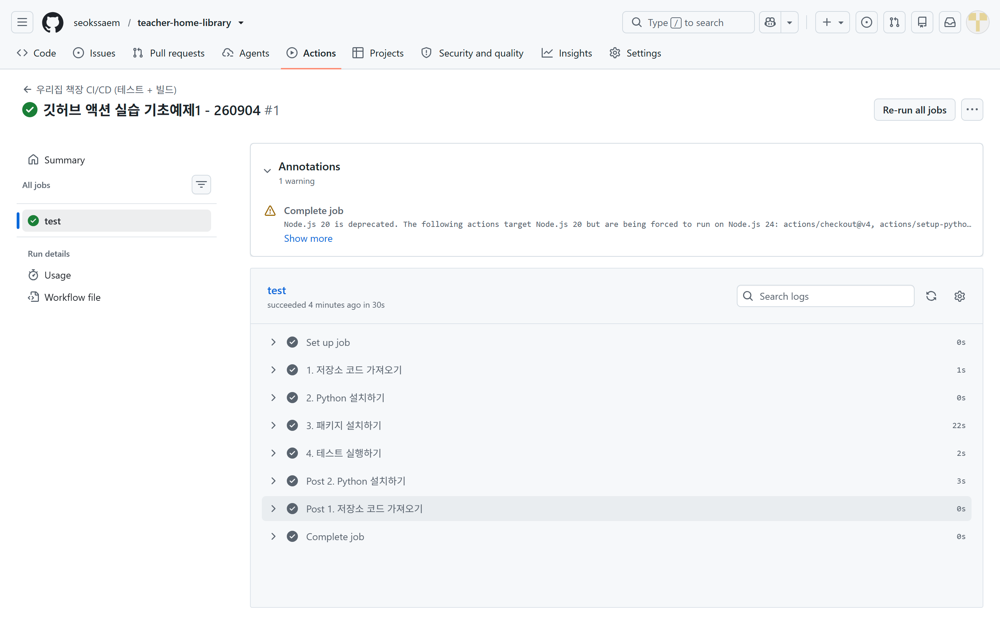
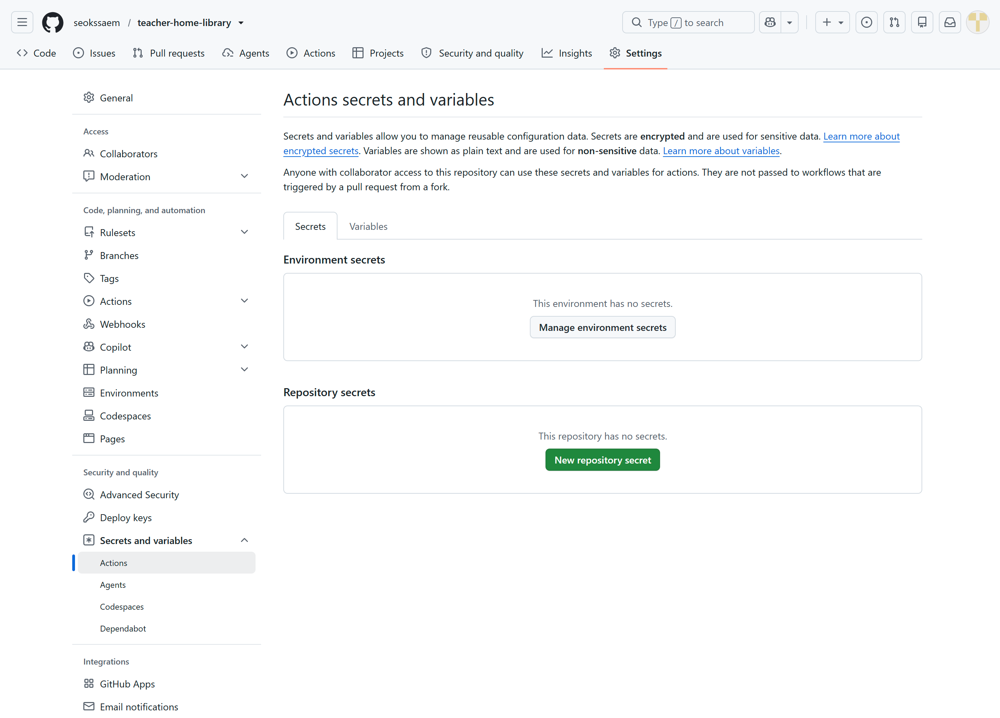
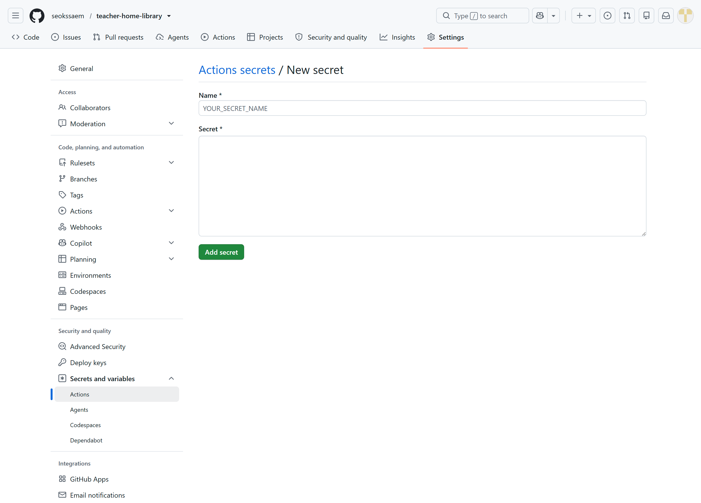

# 🤖 우리집 책장 v5 — GitHub Actions로 CI/CD 맛보기 (AWS 전까지)

**선수 조건:** v4(Jinja2) 완성 + 오늘 `static/style.css` 적용 + Docker 결합 작업까지 끝난 상태
**오늘 다루는 범위:** 1단계 CI(테스트 자동화) → 2단계 Build(Docker 이미지 자동 빌드/Docker Hub 업로드)
**오늘 다루지 않는 범위:** 3단계 CD(SSH로 AWS 서버에 실제 배포) — 다음 세션

<aside>
🎯

**오늘의 목표**

- push만 하면 GitHub이 알아서 pytest를 돌려주는 걸 눈으로 확인합니다.
- 테스트를 통과한 코드만 Docker 이미지로 자동 빌드되어 Docker Hub에 올라가는 것까지 확인합니다.
- "명령어 암기"가 아니라 "작은 성공 세 번"을 경험하는 게 목표입니다.
</aside>

<aside>
📌

**예광탄 원칙 그대로**: 기존 `main.py`, `database.py`, `models.py`, `services/` 로직은 단 한 글자도 바뀌지 않습니다. 오늘 새로 추가되는 파일은 `.github/workflows/test.yml`과 `tests/test_main.py` 딱 두 개뿐입니다.

</aside>

---

## 0. 도입 — 오늘 뭘 하는지 (10~15분)

| 순서 | 내용 | 강사 포인트 |
| --- | --- | --- |
| 1 | "GitHub Actions로 배포 자동화하기" 타이틀 소개 | "명령어 암기는 NO! push만 하세요. 검증은 제가 할게요." — 오늘의 톤을 이 한 문장으로 잡고 시작 |
| 2 | 예광탄 원칙 다시 강조 | 기존 코드는 안 건드린다는 안심 포인트를 먼저 줘야 다음 단계에 대한 거부감이 줄어듦 |
| 3 | "무엇이 유지되고, 무엇이 추가되는가?" | `main.py` 등은 그대로, `.github/workflows/test.yml`, `tests/test_main.py`만 신규 |
| 4 | 빵집 비유로 CI/CD 이해하기 | CI = 셰프가 맛보기(테스트), CD = 포장·매대 진열(배포). **오늘은 CD 중 "포장(Docker 이미지)"까지만 하고, "매대 진열(서버 배포)"은 다음 시간이라고 이 자리에서 명확히 짚어주기** |
| 5 | Docker vs GitHub Actions 역할 분담 | "공간의 마법사(Docker) vs 시간의 마법사(Actions)" — 대체재가 아니라 콤비라는 것 강조 |
| 6 | GitHub Actions 핵심 개념 해부 | Workflow(전체 시나리오) → Job(test, build) → Step(세부 명령) → Runner(가상 컴퓨터) → Secrets(민감정보 보관소, 나중에 사용) |

> 💡 **강사 멘트**: "오늘은 딱 두 가지만 할 거예요. 첫째, push할 때마다 자동으로 테스트가 돌아가게 만들기. 둘째, 그 테스트를 통과한 코드만 Docker 이미지로 자동 포장되게 만들기. 실제로 서버에 배포하는 건 다음 시간에 합니다."

---

## 1. CI 단계 — 테스트 자동화 (메인, 40~50분)

### 1-1. 왜 DB 없는 테스트부터 하는가 ('무균실' 원칙)

- **우리 로컬 PC**: PostgreSQL이 이미 깔려 있고 익숙한 도구가 널려 있는 작업실.
- **GitHub Runner**: 우리 DB가 전혀 없는 "깨끗한 빈 컴퓨터".
- 처음부터 DB 연동 테스트를 넣으면, 실패했을 때 "내 코드가 틀렸나?"와 "환경이 달라서 실패했나?"를 구분할 수 없다.
- **오늘 1단계 목표**: DB 연결 없이 통과하는 가장 순수한 테스트 1개로, 파이프라인(컨베이어 벨트)이 제대로 도는지부터 눈으로 확인한다.

### 1-2. Step 1 — 뼈대 테스트 작성 (`tests/test_main.py`)

v4에서 이미 만든 `services/recognition.py`의 `normalize_isbn()` 함수를 그대로 재사용합니다. DB도, 국립중앙도서관 API 키도 필요 없는 **순수 함수**라서 오늘 목표에 정확히 맞습니다.

```python
'''
home_library_v4 / tests/test_main.py
-----------------------------------------------
GitHub Actions 실습용 최소 테스트 (v5)

- DB, 외부 API(국립중앙도서관) 없이도 통과하는 "순수 로직"만 검증한다.
- 검증 대상: services/recognition.py 의 normalize_isbn() 함수
  (OCR로 뽑은 문자열이 진짜 유효한 ISBN인지 체크섬으로 확인하는 함수, v4 수업에서 이미 배움)
- 이 파일이 GitHub Actions(CI)에서 push할 때마다 자동으로 실행된다.
'''
from services.recognition import normalize_isbn


def test_하이픈이_있는_isbn13을_숫자로_정리한다():
    # 978-89-6626-318-9 는 체크섬이 맞는 정상 ISBN-13이다.
    # 하이픈(-)을 제거하고 순수 숫자 13자리 문자열로 반환되는지 확인한다.
    assert normalize_isbn('978-89-6626-318-9') == '9788966263189'


def test_체크섬이_틀린_isbn은_none을_반환한다():
    # 마지막 자리만 9 -> 0으로 바꿔서 체크섬이 깨지도록 만든 값이다.
    # normalize_isbn은 "숫자처럼 보이지만 가짜인 ISBN"을 여기서 걸러내야 한다.
    assert normalize_isbn('978-89-6626-318-0') is None
```

> 💡 **강사 멘트**: "우리가 v4에서 만든 함수를 그대로 갖다 씁니다. 새로운 로직을 짜는 게 아니라, 이미 있는 로직이 계속 맞게 동작하는지 자동으로 확인하는 안전장치를 만드는 거예요."

### 1-3. Step 2 — 테스트 장비 챙기기 (`requirements.txt` 업데이트)

Runner(무균실)가 테스트를 진행할 때 필요한 도구를 추가합니다.

```bash
uv add --dev pytest httpx
uv export --no-hashes -o requirements.txt
```

기존 목록 아래에 두 줄만 추가되면 됩니다.

```
...
jinja2==3.1.5
pytest
httpx
```

> `httpx`가 왜 필요하냐고 물으면: 지금은 안 쓰지만, 다음에 FastAPI 엔드포인트까지 테스트할 때 `TestClient`가 내부적으로 필요로 하는 라이브러리라서 미리 챙겨둔다고 설명하면 됩니다.

### 1-4. Step 3 — 자동화 시나리오 작성 (`.github/workflows/test.yml`)

<aside>
🚨

**경로 주의**: `.github/workflows/test.yml` — 점(`.github`)과 복수형(`workflows`, s 있음)을 반드시 확인하세요. 하나라도 틀리면 Actions 탭에 아무것도 안 뜹니다.

</aside>

```yaml
# 이 파일은 프로젝트 루트의 .github/workflows/test.yml 로 복사해서 사용합니다.
name: 우리집 책장 CI/CD (테스트 + 빌드)

on:
  push:
  pull_request:

jobs:
  test:
    runs-on: ubuntu-latest # GitHub이 무료로 빌려주는 깨끗한 가상 컴퓨터 (Runner)

    steps:
      - name: 1. 저장소 코드 가져오기
        uses: actions/checkout@v4

      - name: 2. Python 설치하기
        uses: actions/setup-python@v5
        with:
          python-version: "3.12"
          cache: pip

      - name: 3. 패키지 설치하기
        run: |
          python -m pip install --upgrade pip
          pip install -r requirements.txt

      - name: 4. 테스트 실행하기
        # pytest 대신 python -m pytest를 쓰는 이유:
        # tests/ 폴더에 __init__.py가 없으면 프로젝트 루트가 sys.path에 안 잡혀서
        # 'services' 모듈을 못 찾는 ModuleNotFoundError가 날 수 있다.
        run: python -m pytest -v
```


# 상세 주석 버전 (`test.yml`)

```yaml
# 이 파일은 프로젝트 루트의 .github/workflows/test.yml 로 복사해서 사용합니다.
# 경로 주의: .github (점 하나) / workflows (복수형 s) / test.yml
name: 우리집 책장 CI/CD (테스트 + 빌드)
# name: 은 GitHub Actions 탭에서 이 워크플로우를 부르는 이름.
# 저장소에 워크플로우가 여러 개일 때 구분하는 용도라, 뭘 하는 파일인지 알아보기 쉽게 짓는다.

on:
  # on: 은 "언제 이 워크플로우를 실행할지"를 정하는 트리거(방아쇠).
  push:
    # push: 값을 안 적으면 "모든 브랜치에 push할 때마다" 실행된다.
    # (특정 브랜치만 걸고 싶으면 branches: [main] 처럼 제한 가능 — 오늘은 전체 허용)
  pull_request:
    # pull_request: PR을 새로 만들거나, PR에 커밋을 추가로 올릴 때도 실행된다.
    # "병합되기 전에 미리 검증"하는 용도.

jobs:
  # jobs: 아래에는 실행할 작업 단위(Job)들을 나열한다.
  # Job은 서로 독립된 가상 컴퓨터(Runner)에서 각각 실행되며, 기본적으로 병렬로 돈다.
  test:
    # 'test' 는 이 job의 이름(우리가 직접 지은 식별자). Actions 탭에 이 이름으로 표시된다.
    runs-on: ubuntu-latest
    # runs-on: 이 job을 어떤 운영체제의 가상 컴퓨터에서 돌릴지 지정.
    # GitHub이 무료로 빌려주는 깨끗한 Ubuntu Linux 가상 컴퓨터 (Runner).
    # 매번 완전히 새로 생성됐다가 job이 끝나면 통째로 폐기된다 (그래서 '무균실'이라고 비유).

    steps:
      # steps: 는 이 job 안에서 위에서 아래 순서로 실행할 세부 명령들의 목록.
      # 리스트(- 로 시작)이므로 순서가 중요하다.

      - name: 1. 저장소 코드 가져오기
        # name: 은 이 step을 사람이 알아보기 쉽게 부르는 이름 (로그에 이 이름으로 표시됨)
        uses: actions/checkout@v4
        # uses: 는 "남이 미리 만들어둔 재사용 가능한 액션(Action)"을 가져다 쓴다는 뜻.
        # actions/checkout 은 GitHub 공식 액션으로, 지금 이 Runner(빈 컴퓨터) 안으로
        # 우리 저장소의 코드를 git clone 해오는 역할을 한다.
        # 이 스텝이 없으면 Runner는 우리 코드가 뭔지조차 모르는 완전히 빈 컴퓨터다.
        # @v4 부분은 "이 액션의 몇 번째 버전을 쓸지" 지정하는 것 — 아래에서 자세히 설명.

      - name: 2. Python 설치하기
        uses: actions/setup-python@v5
        # actions/setup-python: 이 Runner 안에 파이썬 인터프리터를 설치해주는 공식 액션.
        # 아무 설치가 안 된 빈 Ubuntu이므로, python 명령어 자체가 이 스텝 전에는 없다.
        with:
          # with: 는 uses로 가져온 액션에 "옵션값"을 넘겨줄 때 쓴다.
          python-version: "3.12"
          # 어떤 파이썬 버전을 설치할지. 숫자처럼 보이지만 반드시 따옴표로 감싼 문자열로
          # 써야 한다. 안 그러면 YAML이 3.12를 숫자로 해석해서 3.1로 잘릴 수 있다.
          cache: pip
          # cache: pip 을 넣으면, requirements.txt 내용이 안 바뀌는 한 다음 실행부터는
          # 패키지를 매번 새로 다운로드하지 않고 캐시를 재사용해서 속도가 빨라진다.

      - name: 3. 패키지 설치하기
        run: |
          python -m pip install --upgrade pip
          pip install -r requirements.txt
        # run: 은 uses:(남이 만든 액션)와 달리, 우리가 직접 셸 명령어를 실행할 때 쓴다.
        # | (파이프) 뒤에 여러 줄을 쓰면 "이 줄들을 순서대로 셸에서 실행해라"는 뜻.
        # 1) pip 자체를 최신 버전으로 업그레이드 (오래된 pip가 설치 오류를 내는 걸 예방)
        # 2) requirements.txt에 적힌 패키지들을 정확히 그 버전으로 설치

      - name: 4. 테스트 실행하기
        # pytest 대신 python -m pytest를 쓰는 이유:
        # tests/ 폴더에 __init__.py가 없으면 프로젝트 루트가 sys.path에 안 잡혀서
        # 'services' 모듈을 못 찾는 ModuleNotFoundError가 날 수 있다.
        run: python -m pytest -v
        # -v 는 verbose(상세) 옵션 — 어떤 테스트 함수가 통과/실패했는지 하나하나 로그에 찍어줌.
        # 이 스텝이 실패(테스트 하나라도 실패)하면 이 job 전체가 빨간 X로 표시되고,
        # 여기서 workflow가 멈춘다 (다음에 build job을 추가하면, test가 실패할 경우
        # build job은 아예 시작되지 않도록 만들 수 있다).
```

---

# `actions/checkout@v4` — 왜 하필 v4인가

## 1. `@v4`가 뭘 가리키는 숫자인가

`actions/checkout`은 GitHub 공식 마켓플레이스 액션인데, 마치 우리가 `requirements.txt`에서 `fastapi==0.128.0`처럼 버전을 고정하듯, `uses:` 뒤의 `@태그`도 **어떤 버전의 액션 코드를 쓸지 고정하는 것**입니다.

```yaml
uses: actions/checkout@v4
```

여기서 `v4`는 이 액션의 **메이저 버전**을 가리키는 태그입니다. `actions/checkout` 저장소는 v1 → v2 → v3 → v4 → (그 이후 버전들)로 계속 발전해왔습니다.

## 2. 왜 `@main`이나 `@latest`가 아니라 `@v4`처럼 특정 버전을 박아두는가

| 방식 | 문제점 |
| --- | --- |
| `uses: actions/checkout@main` | `main` 브랜치는 계속 바뀌는 살아있는 브랜치라, 오늘 잘 되던 workflow가 내일 아무 코드 수정 없이 갑자기 깨질 수 있음. 심지어 누군가 그 저장소를 해킹하면 우리도 모르게 악성코드가 실행될 수 있는 보안 위험도 있음 |
| `uses: actions/checkout@v4` | v4라는 태그가 가리키는 코드는 안정적으로 유지되면서, v4 내에서 발견된 버그 수정(v4.1.0 → v4.1.4처럼)만 자동으로 따라옴. 큰 기능 변경(=다음 메이저 버전 v5)은 우리가 명시적으로 버전을 올리기 전까진 절대 안 들어옴 |

즉, **재현 가능성(오늘 되던 게 내일도 똑같이 돼야 함)과 자동 버그패치 사이의 균형점**이 메이저 버전 태그(`@v4`) 고정입니다. 보안을 극단적으로 챙기는 회사들은 아예 커밋 해시(`@8f4b7f8...`)까지 고정하기도 하지만, 학습 목적으로는 과합니다.

## 3. 왜 하필 v4를 알려드렸는가 (v5, v6, v7도 있는데)

검색해보니 `actions/checkout`은 실제로 v4 이후 v5(Node.js 24 런타임 사용), 그 이후 버전까지 계속 나온 상태입니다. 그런데도 v4를 쓴 이유는:

- v4가 아주 오랫동안 폭넓게 쓰여온 **사실상 표준**이라, 인터넷의 거의 모든 예제·튜토리얼·StackOverflow 답변이 v4 기준이라 학생들이 검색해서 참고하기 좋습니다.
- 이전에 보여드린 스크린샷의 "Node.js 20 is deprecated... actions/checkout@v4... forced to run on Node.js 24"라는 경고가 바로 이 지점입니다. **v4가 당장 고장 난 건 아니고, GitHub이 자동으로 최신 Node 런타임으로 대신 돌려주고 있어서 오늘 실습엔 문제없습니다.** 다만 이 경고를 완전히 없애고 싶으시면, 나중에 `@v4`를 `@v5`(또는 그 이상)로 바꿔서 push해보시면 됩니다 — `with:` 옵션은 거의 그대로 호환되니 교체 자체는 간단합니다.

> 💡 **학생들에게 설명할 때**: "라이브러리 버전 고정(`fastapi==0.128.0`)이랑 완전히 같은 개념이에요. 남이 만든 부품(Action)을 가져다 쓸 때도, 그 부품이 갑자기 바뀌지 않도록 버전을 못 박아두는 겁니다."

```


> (2단계 Build job은 3장에서 이어서 추가합니다 — 오늘은 CI부터 확실히 굴러가는 걸 먼저 보여주는 게 좋습니다.)

### 1-5. 파이프라인 가동! (실행 및 확인)

```bash
git add .github tests requirements.txt
git commit -m "본인이름_비NCS_test"
git push origin 비NCS_영문이름
```

1. **Commit & Push** — 수정한 파일을 GitHub으로 보낸다.
2. **Actions 탭 클릭** — "여기가 우리가 고용한 로봇 비서의 사무실입니다."
3. **실시간 로그 확인** — 방금 push한 workflow가 스스로 톱니바퀴를 돌린다.

### 1-6. 진실의 순간 — 초록 ✅ vs 빨강 ❌

- **성공(✅)**: 완벽합니다. 안심하고 다음 작업을 진행하세요.
- **실패(❌)**: 당황하지 마세요. 실패한 Step의 '로그'를 열어보면 어디서 문제가 생겼는지 정확히 알려줍니다.

> 💡 **강사의 추천**: 여기서 바로 `assert` 조건을 일부러 틀리게 고쳐서 push해보고, 빨간 X를 직접 만나보게 하세요. "자동화는 우리의 프로젝트를 지키는 든든한 보호막입니다" — 실패를 실제로 봐야 이 말이 체감됩니다.

**일부러 실패시켜보기 예시** (시연 후 반드시 원래대로 되돌리기):
```python
def test_하이픈이_있는_isbn13을_숫자로_정리한다():
    assert normalize_isbn('978-89-6626-318-9') == '0000000000000'  # 일부러 틀리게
```

### 1-7. 자주 발생하는 문제 (Troubleshooting Matrix)

| 증상 | 원인 | 처방 |
| --- | --- | --- |
| Actions 탭에 아무것도 안 뜸 | 파일 경로 오타 (`.github/workflow`처럼 s 누락 등) | 경로를 `.github/workflows/test.yml`로 정확히 수정 |
| `No module named 'services'` | pytest 실행 위치가 프로젝트 루트가 아니거나, `pytest -v`로 실행함 | `python -m pytest -v`로 실행하는지, 폴더 구조가 루트에서 실행되는지 점검 |
| `ImportError: fastapi.testclient` | 패키지 누락 | `requirements.txt`에 `httpx` 추가 확인 |
| 로컬은 되는데 Actions에서만 실패 | 환경변수(`.env` 등)에 의존하는 코드가 섞여 있음 | 1단계 테스트는 DB/외부 API 없는 코드만 검증하도록 범위 축소 |

### 1-8. 오늘의 CI 성공 체크리스트

- [ ]  `tests/test_main.py` 파일 생성 완료
- [ ]  `requirements.txt`에 `pytest`, `httpx` 2줄 추가 완료
- [ ]  `.github/workflows/test.yml` 생성 (경로와 오타 꼼꼼히 재확인!)
- [ ]  로컬 안전망 테스트: `uv run pytest -v`로 먼저 통과 확인
- [ ]  GitHub push 후 Actions 탭에서 초록색 체크(✅) 확인
- [ ]  (선택) 일부러 테스트를 실패하게 고쳐서 빨간 X와 로그 살펴보기

---

## 2. Build 단계 — Docker 이미지 자동 빌드 (30분, AWS 직전까지)

### 2-1. GitHub Secrets 비밀 금고 설정

자동 배포를 위해 가상 컴퓨터(Runner)가 Docker Hub에 로그인할 '열쇠'가 필요합니다. 코드에 직접 적으면 안 되므로 완벽히 격리해서 보관합니다.

**설정 위치:** GitHub 저장소 → `Settings` → `Secrets and variables` → `Actions` → `New repository secret`

| Name | Value |
| --- | --- |
| `DOCKER_USERNAME` | Docker Hub 계정명 (`seokssaem1`) |
| `DOCKER_TOKEN` | Docker Hub → Account Settings → Security → **New Access Token**으로 발급한 토큰 |

<aside>
⚠️

**절대 계정 비밀번호를 그대로 넣지 마세요.** 반드시 Access Token을 새로 발급해서 등록합니다. 토큰은 나중에 언제든 무효화할 수 있지만, 비밀번호가 유출되면 계정 전체가 위험해집니다. Secret 이름도 `DOCKER_TOKEN`으로 지어서 "이건 비밀번호가 아니라 토큰"이라는 걸 헷갈리지 않게 합니다.

</aside>

**3단계 마법:**
1. **웹 UI 등록**: `DOCKER_USERNAME`, `DOCKER_TOKEN` 대문자로 명명하여 실젯값 등록
2. **YAML에서 호출**: `${{ secrets.DOCKER_TOKEN }}` — 코드 노출 없이 변수로 소환
3. **로그 마스킹**: 실행 창에 노출되지 않도록 자동으로 `***` 별표 처리됨 (GitHub이 알아서 해줌)

### 2-2. [2단계: Build] Docker 이미지로 포장하기

CI 검사를 무사히 마친 코드들만 Docker 이미지로 가공되어 Docker Hub로 업로드됩니다. `test.yml`에 `build` job을 이어서 추가합니다.

```yaml
  # ─────────────────────────────────────────────
  # 2단계: Build — 테스트를 통과한 코드만 Docker 이미지로 포장
  # (needs: test 덕분에 test가 실패하면 이 job은 아예 시작되지 않는다)
  # ─────────────────────────────────────────────
  build:
    needs: test
    runs-on: ubuntu-latest
    if: github.ref == 'refs/heads/main'

    steps:
      - name: 코드 가져오기
        uses: actions/checkout@v4

      - name: Docker Hub 로그인
        uses: docker/login-action@v3
        with:
          username: ${{ secrets.DOCKER_USERNAME }}
          password: ${{ secrets.DOCKER_TOKEN }}

      - name: 이미지 빌드 및 Docker Hub 업로드
        uses: docker/build-push-action@v6
        with:
          context: .
          push: true
          tags: ${{ secrets.DOCKER_USERNAME }}/home-library:latest
```


# 상세 주석 버전 (`build` job)

```yaml
  # ─────────────────────────────────────────────
  # 2단계: Build — 테스트를 통과한 코드만 Docker 이미지로 포장
  # (needs: test 덕분에 test가 실패하면 이 job은 아예 시작되지 않는다)
  # ─────────────────────────────────────────────
  build:
    # 'build' 는 이 job의 이름. 위의 'test' job과 완전히 별개의 job이라,
    # 원래는 서로 다른 Runner에서 각자 독립적으로/병렬로 실행되는 게 기본값이다.
    # 하지만 바로 아래 needs: 로 이 병렬 실행을 강제로 순서 있게 바꾼다.

    needs: test
    # needs: 는 "이 job을 실행하기 전에, 먼저 끝나야 하는 다른 job"을 지정한다.
    # test가 성공(초록불)해야만 build가 시작되고, test가 하나라도 실패(빨간 X)하면
    # build는 아예 실행되지 않고 건너뛴다.
    # → 이게 바로 "테스트 안 된 코드는 이미지로도 못 만든다"는 안전장치의 핵심.

    runs-on: ubuntu-latest
    # test job과 마찬가지로 새로 생성되는 깨끗한 Ubuntu Runner.
    # test job에서 쓰던 Runner를 재사용하는 게 아니라 완전히 별개의 새 컴퓨터라는 점 주의
    # (그래서 아래에서 checkout을 또 한 번 해야 코드가 이 Runner 안에도 존재하게 된다).

    if: github.ref == 'refs/heads/main'
    # if: 는 이 job 자체를 실행할지 말지 결정하는 조건문.
    # github.ref 는 "지금 이 workflow를 트리거한 브랜치가 뭔지" 담긴 값.
    # 'refs/heads/main' 은 브랜치 이름이 정확히 main일 때를 뜻하는 GitHub 내부 표기법.
    # → PR을 올리거나 다른 브랜치에 push할 때는 test만 돌고 build는 건너뛰고,
    #   실제로 main에 merge(또는 main에 직접 push)됐을 때만 이미지를 만든다.
    #   (Docker Hub 업로드 횟수를 줄여서 시간/저장공간 절약)

    steps:
      - name: 코드 가져오기
        uses: actions/checkout@v4
        # 위에서 설명한 것과 동일한 액션. build job은 test job과 완전히 다른
        # 새 Runner에서 시작하기 때문에, 여기서도 다시 한번 우리 코드를 복사해와야 한다.
        # (test job에서 이미 checkout 했다고 build job에서 자동으로 이어지지 않는다!)

      - name: Docker Hub 로그인
        uses: docker/login-action@v3
        # docker/login-action: Docker 공식(docker 조직) 제공 액션으로,
        # 이 Runner가 Docker Hub에 로그인해서 이미지를 push할 권한을 얻게 해준다.
        # (로그인 안 하면 다음 단계에서 이미지를 만들 수는 있어도 업로드는 거부당한다.)
        with:
          username: ${{ secrets.DOCKER_USERNAME }}
          # ${{ }} 는 GitHub Actions에서 "값을 여기 끼워넣어라"는 표현식 문법.
          # secrets.DOCKER_USERNAME 은 저장소 Settings에 등록해둔 비밀값을 그대로 가져옴.
          # 코드에 seokssaem1 이라고 직접 안 쓰고 이렇게 하는 이유는
          # 저장소가 Public이라 로그에도, 코드에도 실제 계정 정보가 노출되면 안 되기 때문.
          password: ${{ secrets.DOCKER_TOKEN }}
          # ⚠️ 이 값은 Docker Hub 계정 '비밀번호'가 아니라 Access Token이어야 한다.
          # GitHub이 이 값을 로그에 자동으로 *** 처리(마스킹)해주지만,
          # 애초에 비밀번호 자체를 여기 넣지 않는 게 원칙 (토큰은 나중에 무효화 가능).

      - name: 이미지 빌드 및 Docker Hub 업로드
        uses: docker/build-push-action@v6
        # docker/build-push-action: 'docker build' + 'docker push' 두 명령어를
        # 한 번에 대신 실행해주는 Docker 공식 액션.
        with:
          context: .
          # context: . 는 "저장소 루트에 있는 Dockerfile을 기준으로 빌드해라"는 뜻.
          # 우리가 로컬에서 손으로 docker build . 이라고 치던 것과 완전히 동일한 의미.
          push: true
          # true로 설정하면 빌드만 하고 끝나는 게 아니라, 바로 위에서 로그인한 계정으로
          # Docker Hub에 자동으로 업로드까지 진행한다. (false면 빌드 테스트만 하고 안 올림)
          tags: ${{ secrets.DOCKER_USERNAME }}/home-library:latest
          # 이미지에 붙일 이름표(태그). '계정명/이미지이름:버전' 형식.
          # secrets를 재사용해서 계정명을 하드코딩하지 않은 것 — 나중에 이 workflow를
          # 다른 학생이 자기 계정으로 그대로 복사해도 코드 수정 없이 바로 동작한다.
```

---

# `docker/login-action@v3` — 이 숫자의 의미

체크아웃 액션과 완전히 같은 원리입니다. `docker/login-action`도 GitHub Actions 마켓플레이스에 등록된 재사용 가능한 액션이고, `@v3`는 그 액션의 **메이저 버전 태그**입니다.

## 실제 검색해서 확인한 버전 히스토리

| 버전 | 핵심 변경점 |
| --- | --- |
| v2 | 이전 세대 |
| **v3** (오늘 쓴 버전) | Node.js 20을 기본 실행 런타임으로 사용하도록 변경 |
| v4 | Node.js 24를 기본 실행 런타임으로 사용하도록 변경 (최신 안정 버전은 v4.6.x대) |

즉, `actions/checkout` 때와 같은 패턴입니다 — **메이저 버전이 하나씩 올라갈 때마다 내부적으로 더 최신 Node.js 런타임을 쓰도록 바뀌고, 그 김에 자잘한 기능(예: AWS ECR·Azure 레지스트리 지원 강화, 로그 마스킹 개선 등)도 같이 추가되는 방식**입니다.

## 왜 오늘은 v4가 아니라 v3를 알려드렸는가

- `docker/login-action`은 지금 v3와 v4가 둘 다 활발히 유지보수되고 있는데, v3도 여전히 지원되는 버전이라 당장 문제가 생기진 않습니다.
- 다만 앞서 `actions/checkout@v4`에서 보셨던 것과 똑같이, v3는 Node 20 기반이라 나중에 비슷한 "deprecated" 경고가 뜰 가능성이 있습니다. **경고가 뜨면 `@v3`를 `@v4`로 바꿔서 push**하시면 됩니다 — `with:` 안의 `username`/`password` 옵션명은 그대로라 다른 코드 수정 없이 태그 숫자만 바꾸면 됩니다.

## 정리하면

`actions/checkout@v4`든 `docker/login-action@v3`든 `docker/build-push-action@v6`이든, **"@뒤의 숫자 = 그 액션 제작자가 메이저 버전을 어디까지 올렸는지"** 이고, 우리는 그중 널리 쓰이는 안정적인 지점을 골라서 고정해둔 것입니다. 학생들에게는 "라이브러리 버전 고정이랑 완전히 같은 개념이 액션에도 똑같이 적용된다"고 한 번 더 강조해주시면 앞서 배운 `requirements.txt` 버전 고정 개념과 자연스럽게 이어질 것 같습니다.


| 설정 | 의미 |
| --- | --- |
| `needs: test` | test job이 성공했을 때만 build가 시작됨 — "완성형 CI/CD 파이프라인은 기다림의 사슬" |
| `if: github.ref == 'refs/heads/main'` | PR 단계에서는 테스트만 돌고, `main`에 실제로 merge됐을 때만 이미지를 빌드/푸시 |

<aside>
🐳

**Dockerfile 사전 점검 필수**: 오늘 Docker 결합 작업 시 `Dockerfile`의 `COPY` 목록에 `templates/`, `static/`이 반드시 포함되어야 합니다. 빠지면 `docker build`는 성공해도 `docker run` 시점에 `Directory 'static' does not exist` 에러로 컨테이너가 즉시 죽습니다. (오늘 Docker 작업 단계에서 먼저 확인해주세요.)

</aside>

### 2-3. 실행 및 확인

```bash
git add .github
git commit -m "본인이름_비NCS_test"
git push origin 비NCS_영문이름
```

1. Actions 탭에서 `test` job이 먼저 실행되고 초록불 확인
2. 이어서 `build` job이 실행되는지 확인 (main 브랜치일 때만)
3. [Docker Hub](https://hub.docker.com) 본인 계정에서 `home-library:latest` 이미지가 새로 올라왔는지 확인

> 💡 **강사 멘트**: "지금까지는 우리가 직접 `docker build`, `docker push`를 손으로 쳤죠. 이제부터는 push 한 번이면 테스트 통과 → 이미지 빌드 → Docker Hub 업로드까지 로봇이 대신 해줍니다. 다음 시간에는 이 이미지를 실제 서버가 자동으로 받아서 실행하는 것까지 배울 거예요."

---

## 3. 오늘 다루지 않는 것 (다음 세션 예고, 짧게만 언급)

- 3단계 CD: GitHub Runner가 SSH로 AWS 서버에 접속해서 새 이미지를 받아 재기동하는 부분
- `SERVER_HOST`, `SERVER_USERNAME`, `SERVER_SSH_KEY` 같은 배포용 Secrets
- `docker stop/rm → docker pull → docker run → docker image prune` 4단계 배포 스크립트

이 부분은 실제 AWS 서버가 준비된 다음 세션에서, 오늘 완성한 CI+Build 파이프라인 뒤에 자연스럽게 이어붙입니다.

---

## 참고 링크

| 자료 | 용도 |
| --- | --- |
| [GitHub Actions 공식 문서](https://docs.github.com/actions) | 문법 레퍼런스 |
| [『러닝 깃허브 액션』(한빛미디어)](https://m.hanbit.co.kr/store/books/book_view.html?p_code=B4917826374) | 심화 학습 (보안, 커스텀 액션, 재사용 워크플로) |

---
---


네, 맞는 화면입니다. 이 페이지에서 발급하시면 됩니다. 각 항목은 이렇게 입력하세요.

## 입력값

| 항목 | 입력할 값 |
| --- | --- |
| **Access token description** | `github-actions-home-library` (용도를 알아볼 수 있는 이름이면 뭐든 OK — 나중에 토큰 목록에서 이 이름으로 구분됩니다) |
| **Expiration date** | `None`으로 두셔도 되고, 걱정되시면 `90 days` 선택 — 학기 중 실습용이라 만료돼도 재발급이 쉬우니 편하신 대로 |
| **Access permissions** | ⚠️ **`Public Repo Read-only`를 반드시 다른 걸로 바꾸셔야 합니다** |

## ⚠️ 가장 중요한 부분 — 권한

지금 기본값인 **"Public Repo Read-only"는 이미지를 "받아오기(pull)"만 가능**합니다. 하지만 GitHub Actions의 `docker/build-push-action`은 이미지를 Docker Hub에 **올려야(push)** 하므로, 이 권한으로는 인증 자체는 되어도 push 시점에 `denied: requested access to the resource is denied` 에러가 납니다.

**Access permissions 드롭다운을 클릭해서 다음 중 하나로 바꿔주세요:**
- **`Read & Write`** ← 이걸 선택하시면 됩니다 (push까지 가능)
- (`Read, Write, Delete`도 있다면 그건 이미지 삭제 권한까지 포함이라 오늘 실습엔 과합니다. `Read & Write`면 충분합니다.)

## 발급 후 할 일

1. **Description** 채우고 **Access permissions**를 `Read & Write`로 바꾼 뒤 **Generate** 클릭
2. 생성된 토큰 문자열이 **딱 한 번만** 화면에 표시됩니다 — 반드시 그 자리에서 복사해두세요 (닫으면 다시 못 봅니다)
3. GitHub 저장소 → `Settings` → `Secrets and variables` → `Actions` → `New repository secret`
   - Name: `DOCKER_TOKEN`
   - Value: 방금 복사한 토큰 문자열 붙여넣기
4. 같은 방식으로 하나 더: Name `DOCKER_USERNAME`, Value는 Docker Hub 계정명 (`seokssaem1`)

이 두 개(`DOCKER_USERNAME`, `DOCKER_TOKEN`)가 등록되면 오늘 만든 `test.yml`의 `build` job이 정상적으로 로그인·push할 수 있습니다.


---


네, 정확히 그 화면이고 하나씩 두 번 반복하시면 됩니다.

## 첫 번째 Secret

| 필드 | 입력값 |
| --- | --- |
| **Name** | `DOCKER_USERNAME` |
| **Secret** | `seokssaem1` (Docker Hub 계정명) |

→ **Add secret** 클릭

## 두 번째 Secret

**Add secret** 클릭하고 나면 자동으로 "New secret" 화면으로 다시 돌아가거나, `Actions secrets` 목록 화면으로 이동합니다. 목록 화면이 뜨면 오른쪽 위 **New repository secret** 버튼을 다시 눌러서 이어가시면 됩니다.

| 필드 | 입력값 |
| --- | --- |
| **Name** | `DOCKER_TOKEN` |
| **Secret** | 아까 Docker Hub에서 발급받아 복사해둔 토큰 문자열 붙여넣기 |

→ **Add secret** 클릭

## 주의할 점

- **Name은 대소문자까지 정확히 일치**해야 합니다. `test.yml`에 `secrets.DOCKER_USERNAME`, `secrets.DOCKER_TOKEN`으로 이미 적어두셨으니, Name도 정확히 그 철자 그대로 넣으셔야 합니다 (오타 나면 `build` job에서 로그인 실패).
- **Secret 값 앞뒤에 공백이나 줄바꿈이 안 들어가게** 붙여넣기 하세요. 특히 토큰을 복사할 때 끝에 스페이스가 하나 딸려오는 경우가 종종 있습니다.
- 등록 후에는 값을 다시 볼 수 없습니다 (수정만 가능, 조회 불가). 혹시 잘못 넣은 것 같으면 삭제 후 다시 추가하시면 됩니다.

두 개 다 등록되면 `Actions secrets` 목록에 `DOCKER_TOKEN`, `DOCKER_USERNAME` 두 줄이 보일 거고, 그 상태에서 `build` job이 포함된 `test.yml`을 push하시면 됩니다.


---












---

좋은 질문입니다 — 헷갈리는 게 당연합니다. 핵심은 **"우리 코드"와 "액션 자체를 실행하는 엔진"이 완전히 다른 이야기**라는 겁니다.

## 두 가지 완전히 다른 파이썬/Node 이야기가 섞여 있었습니다

| | 무엇을 실행하나 | 어떤 언어 |
| --- | --- | --- |
| **우리 프로젝트 코드** | `main.py`, `services/recognition.py`, `tests/test_main.py` | **Python** |
| **`actions/checkout`, `docker/login-action` 같은 액션 자체** | GitHub/Docker 팀이 만들어서 마켓플레이스에 올려둔 "도구 프로그램" | **JavaScript (Node.js)** |

우리가 `.py` 파일을 한 줄도 안 건드렸는데도 "Node.js 20 is deprecated" 경고가 뜬 이유가 바로 이겁니다 — **그 경고는 우리 파이썬 코드 얘기가 아니라, `actions/checkout`이라는 도구 자체가 내부적으로 JavaScript로 짜여 있고, 그 JS 코드를 실행하는 엔진(Node.js) 버전이 오래됐다는 경고**입니다.

## 왜 액션들은 Python이 아니라 Node.js로 만들어졌나

GitHub Actions에는 액션을 만드는 방식이 몇 가지 있는데, 그중 **"JavaScript 액션"**이 압도적으로 많이 쓰입니다.

- Runner(가상 컴퓨터)에 Node.js가 기본으로 미리 설치되어 있어서, 어떤 액션이든 별도 설치 없이 바로 실행 가능 (Python은 언어 자체는 기본 설치돼있지만, 우리가 원하는 정확한 버전은 우리가 직접 골라 설치해야 함)
- Docker 컨테이너 액션(느림, 컨테이너를 새로 띄워야 함)보다 Node.js 액션이 훨씬 빠르게 시작됨
- GitHub이 처음부터 JS/TS 생태계를 액션 개발의 표준으로 밀었음

그래서 `actions/checkout`, `actions/setup-python`, `docker/login-action`, `docker/build-push-action` 전부 **내부 구현은 JavaScript/TypeScript**입니다. `actions/setup-python`조차도, "파이썬을 설치해주는 그 도구 자체"는 Node.js로 짜여 있다는 게 재밌는 지점입니다.

## 우리 workflow에서 실제로 흐름을 나눠보면

```yaml
- uses: actions/setup-python@v5   # ← 이 액션 자체 = Node.js로 실행됨
  with:
    python-version: "3.12"        # ← 이 옵션으로 "우리가 쓸" Python 3.12를 설치

- run: python -m pytest -v         # ← 이제부터는 방금 설치된 진짜 Python이 실행됨
```

즉 `uses:`로 시작하는 스텝들(체크아웃, 파이썬 설치, 도커 로그인, 도커 빌드)은 전부 **"GitHub이 미리 준비해둔 Node.js 도구들"**이 뒤에서 작업을 대신 해주는 거고, `run:`으로 시작하는 스텝(`pip install`, `python -m pytest`)만 **우리가 직접 짠 파이썬 코드/명령어**가 실행되는 부분입니다.

> 💡 **학생들에게 비유하면**: "택배(우리 파이썬 프로젝트)를 보낼 때, 택배 상자 안 내용물은 우리가 만든 거지만, 그걸 배달해주는 배달 기사(액션)는 자기 나름의 방식(Node.js)으로 움직이는 것과 같아요. 배달 기사가 무슨 언어를 쓰든 우리 상자 내용물엔 전혀 영향 없죠."